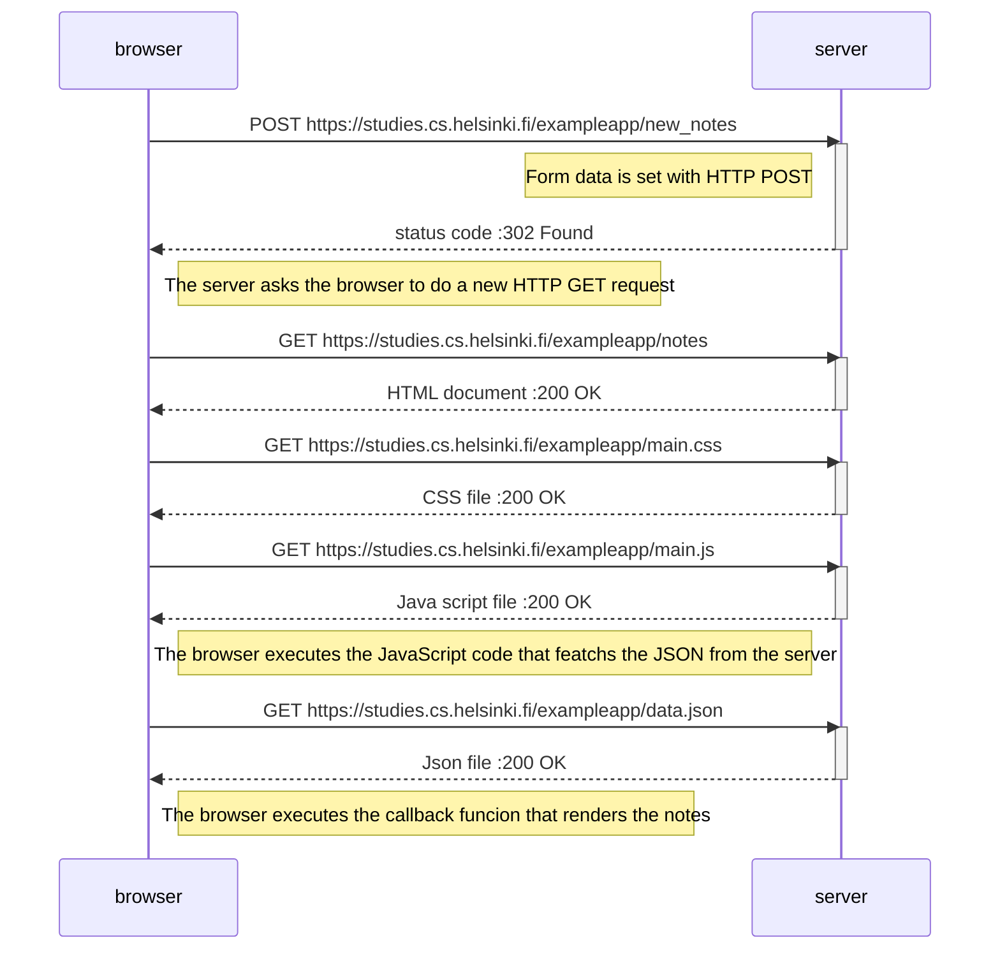

TESTING DIAGRAM

```mermaid
sequenceDiagram
    participant browser
    participant server

    browser->>server: POST https://studies.cs.helsinki.fi/exampleapp/new_notes
    activate server
    Note left of server: Form data is set with HTTP POST
    server-->>browser: status code :302 Found
    deactivate server

Note right of browser:The server asks the browser to do a new HTTP GET request
    browser->>server: GET https://studies.cs.helsinki.fi/exampleapp/notes
    activate server
    server-->>browser: HTML document  :200 OK
    deactivate server

    browser->>server: GET https://studies.cs.helsinki.fi/exampleapp/main.css
    activate server
    server-->>browser: CSS file  :200 OK
    deactivate server

    browser->>server: GET https://studies.cs.helsinki.fi/exampleapp/main.js
    activate server
    server-->>browser: Java script file  :200 OK
    deactivate server
    Note right of browser :The browser executes the JavaScript code that featchs the JSON from the server
    browser->>server: GET https://studies.cs.helsinki.fi/exampleapp/data.json
    activate server
    server-->>browser: Json file  :200 OK
    deactivate server
    Note right of browser :The browser executes the callback funcion that renders the notes
```
