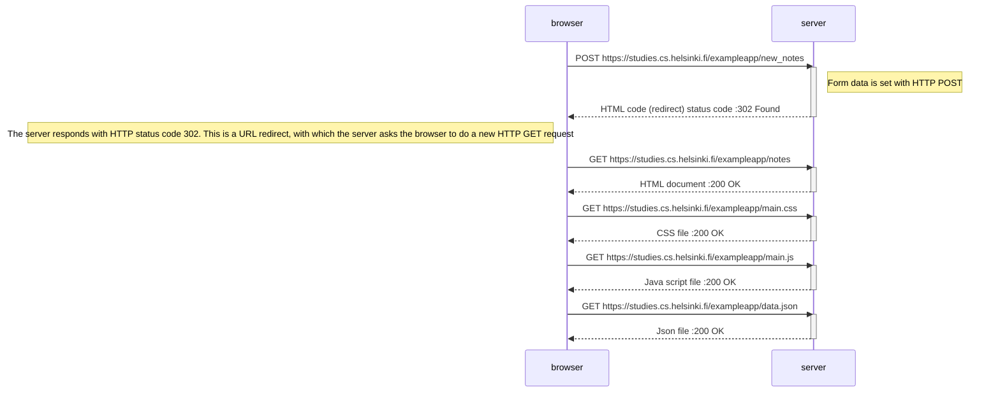

TESTING DIAGRAM

```mermaid
sequenceDiagram
    participant browser
    participant server

    browser->>server: POST https://studies.cs.helsinki.fi/exampleapp/new_notes
    activate server
    Note right of server: Form data is set with HTTP POST
    server-->>browser: HTML code (redirect) status code :302 Found
    deactivate server

Note left of browser:The server responds with HTTP status code 302. This is a URL redirect, with which the server asks the browser to do a new HTTP GET request
    browser->>server: GET https://studies.cs.helsinki.fi/exampleapp/notes
    activate server
    server-->>browser: HTML document  :200 OK
    deactivate server

    browser->>server: GET https://studies.cs.helsinki.fi/exampleapp/main.css
    activate server
    server-->>browser: CSS file  :200 OK
    deactivate server

    browser->>server: GET https://studies.cs.helsinki.fi/exampleapp/main.js
    activate server
    server-->>browser: Java script file  :200 OK
    deactivate server

    browser->>server: GET https://studies.cs.helsinki.fi/exampleapp/data.json
    activate server
    server-->>browser: Json file  :200 OK
    deactivate server
```
