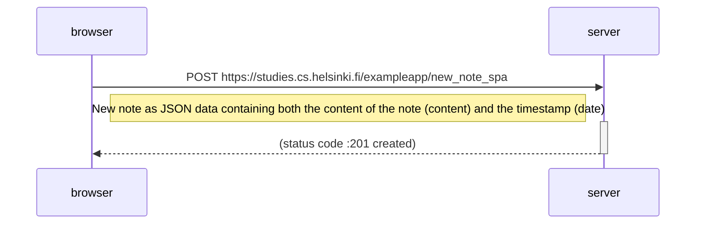

TESTING DIAGRAM

```mermaid
sequenceDiagram
    participant browser
    participant server

    browser->>server: POST https://studies.cs.helsinki.fi/exampleapp/new_note_spa
    Note left of server: New note as JSON data containing both the content of the note (content) and the timestamp (date)
    activate server
    server-->>browser: (status code :201 created)
    deactivate server


```
